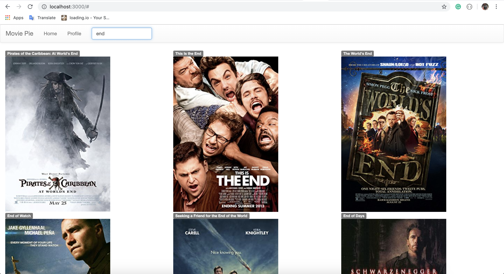

# Movie Pie App

#### Requirements
- Docker
- Docker Compose
- Movie Pie App Backend

#### Instructions
1. Clone this project
2. Run
```
docker-compose up
```
3. Browse at `http://localhost:3000`


